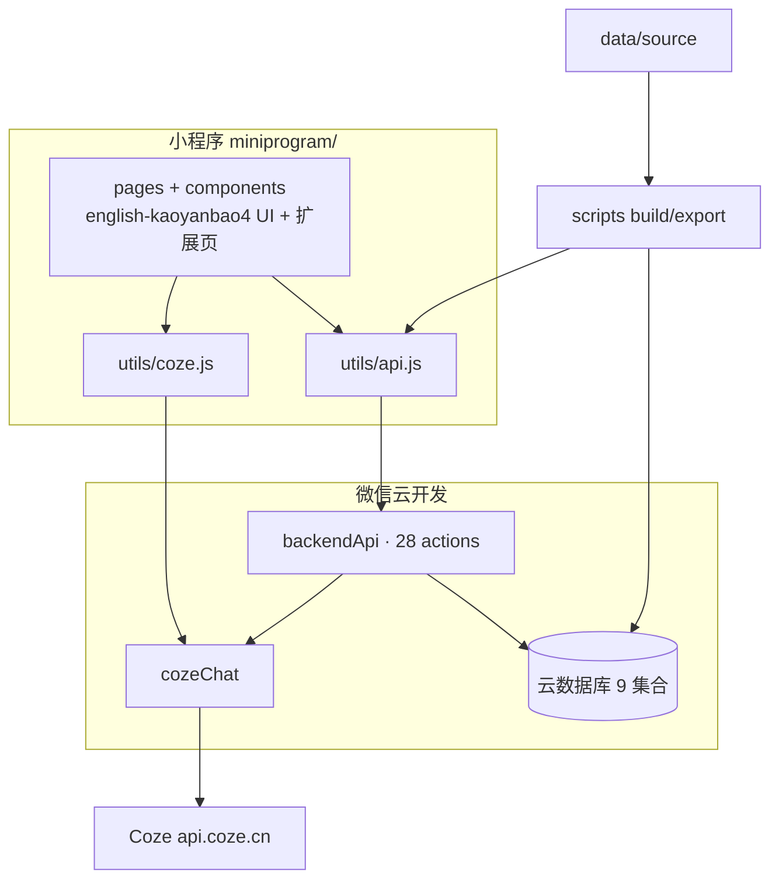
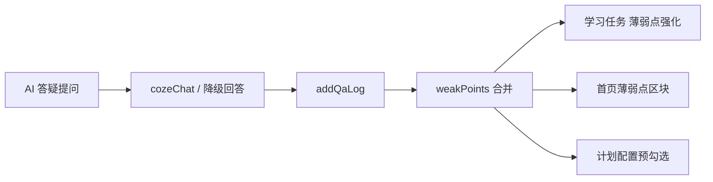

# 英语考研宝 — 项目技术说明（当前版）

> 更新日期：**2026-08-09（晚间修订）**  
> 工程目录：`miniprogram-1/miniprogram-1`（微信开发者工具请打开此目录）  
> 数据版本：`1.2.1`（含 2026 招生参考部分更新）｜云函数：`backendApi`、`cozeChat`（已部署，`cozeChat` 建议超时 60s）

本文档为技术总览，细节见文末索引。

---

## 1. 当前交付状态

| 模块 | 状态 | 说明 |
|------|------|------|
| 前端 UI | ✅ 已合并 | 吸收 `english-kaoyanbao4`，运行工程为本目录 |
| 云开发环境 | ✅ 已开通 | env：`cloudbase-d2guuc5j91913a1bb` |
| 云函数 | ✅ 已部署 | `backendApi`、`cozeChat`（均建议超时 **60s**；计划生成会嵌套调 Coze） |
| 云数据库 | ✅ 已建库灌数 | 9 集合；院校 25 / FAQ 35 / 范文 16 |
| AI（Coze） | ✅ 小程序实测可用 | 经 `cozeChat`；PAT 需有效；失败可本地演示降级 |
| 薄弱点闭环 | ✅ 已上线 | 答疑 → `weakPoints` → 首页/任务/计划预勾选 |
| 技术文档 | ✅ 已同步 | 架构 / API / AI / 对接 / 数据 |

**勿再单独打开** `english-kaoyanbao4` 做联调（其为 mock UI 包）。

---

## 2. 总体架构

**调用约定（重要）**

- 业务：`api('actionName', data)` → `wx.cloud.callFunction({ name: 'backendApi' })`  
- AI：`askCoze(...)` → 云函数 `cozeChat`  
- 前端同学 REST 文档（`/api/...`）**仅作需求对照**，不按 HTTP 路径实现  

---

## 3. 目录结构

| 路径 | 说明 |
|------|------|
| `miniprogram/` | 页面 UI、`utils/`、配置 |
| `cloudfunctions/backendApi` | 业务云函数 |
| `cloudfunctions/cozeChat` | AI 代理云函数 |
| `data/source/` | 内容单一数据源 |
| `data/export/cloud-import/` | 云库导入包（**JSON Lines**） |
| `scripts/` | validate / build / export |
| `docs/` | 全部技术文档 |

---

## 4. 页面一览（`app.json`）

| 分组 | 页面 |
|------|------|
| 账号 | `login` |
| 选校 | `school-select` → `school-list` → `school-detail` |
| 主站 | `home`、`progress`、`statistics`、`profile`（自定义 tabBar） |
| 学习 | `focus-timer`、`plan-setup` / `plan-generating` / `plan-result` |
| AI / 内容 | `ai-qa`、`faq` / `faq-detail`、`essay-review`、`essay-samples` / `essay-sample-detail` |
| 合规 | `legal/privacy`、`legal/agreement`、`feedback` |
| 管理 | `admin-login`、`admin-dashboard`、`admin-school-users` |

---

## 5. 数据与云库

| 集合 | 规模 / 说明 |
|------|-------------|
| `universities` | 25（含 `directionIds`） |
| `faqs` | 35 |
| `essay_samples` | 16 |
| `users` / `focus_sessions` / `qa_logs` / `study_plans` / `essay_reviews` / `feedbacks` | 运行时写入 |

- `users.weakPoints`：答疑抽取的薄弱点数组（最多 5 项，含 `id/name/count/task`）  
- 权限建议：仅创建者可读写（经云函数访问）  
- 导入格式：JSON Lines（每行一条），见 `data/export/cloud-import/`  
- 内容数据来源：团队整理公开招生/备考信息，维护于 `data/source/`

---

## 6. API 与 AI（摘要）

- **28** 个 `backendApi` action：用户、院校、FAQ、范文、专注、计划、批改、反馈、管理  
- AI：答疑 / 计划生成 / 作文批改；计划与批改失败时模板或规则兜底  
- **薄弱点闭环**：`addQaLog`（或前端兜底）抽取标签 → 更新 `weakPoints` → `addStudyTask`；首页展示「薄弱点强化」  
- 密钥仅放云函数本地配置（已 gitignore），详见仓库根 `README.md`

### 6.1 薄弱点闭环（演示重点）

关键词规则见 `miniprogram/utils/weakPoints.js`（与 `cloudfunctions/backendApi/weakPoints.js` 同步）。

---

## 7. 前后端协作约定

| 角色 | 改哪里 |
|------|--------|
| 前端 | `pages/*/wxml`、`wxss`、`images`（保留 js 中的 `api` / `askCoze`） |
| 后端 / 数据 | `utils/`、`cloudfunctions/`、`data/source/`、云控制台 |
| 对接约定 | 前端 REST 文档仅作需求对照；实现统一为 `api('action', data)` |

---

## 8. 仓库文档约定

本仓库 **对外只维护本文**（`docs/项目技术说明-当前版.md`）作为技术说明终极版。  
部署细则、iCAN 原创材料、历史合并记录等其它 md **仅本地保留**，不推送 GitHub。
